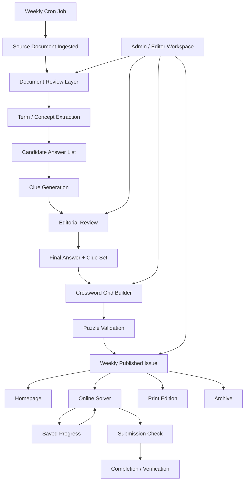

# Architecture

## Product Flow

## Screen Map

The prototype currently models five user-facing surfaces:

1. `/#/`
   Homepage with weekly issue framing, resume state, and archive overview.
2. `/#/issue/:issueId`
   Source dossier for the current issue, including term extraction and clue review context.
3. `/#/solver/:issueId`
   Online solving screen with grid, active clue, clue list, and action panel.
4. `/#/archive`
   Archive of current and prior issues.
5. `/#/print/:issueId`
   Print-oriented issue layout.

## Current Boundaries

- Frontend only
  The repo currently contains a React + Vite prototype and no backend services yet.
- Static content
  Documents, clues, archive entries, and progress states are represented with placeholder data.
- Lightweight routing
  Hash-based navigation is being used to validate screen structure before introducing a fuller router.
- No scheduler implementation yet
  The weekly cron job exists only as a product concept and flow dependency at this stage.

## Near-Term Build Order

1. Introduce real app data models for issue, clue, document, and progress state.
2. Split the large `App.tsx` prototype into route-level view modules and shared components.
3. Add solver interaction state so cell focus, clue selection, and entry progress become real.
4. Define backend boundaries for document ingestion, clue generation, grid generation, and publishing.
5. Add scheduling and publication automation after the issue pipeline is stable.
